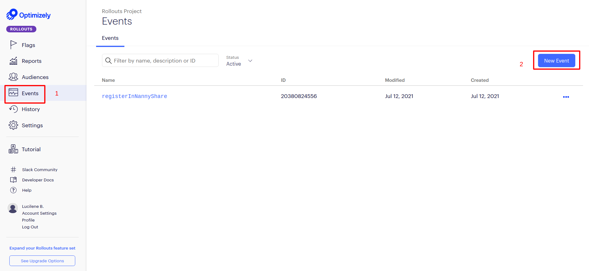

<h1 align="center">
   
    </br>
    Hapu
</h1>

<p align="center">
  <a href="#about">About</a>&nbsp;&nbsp;&nbsp;|&nbsp;&nbsp;&nbsp;
  <a href="#technologies">Technologies</a>&nbsp;&nbsp;&nbsp;|&nbsp;&nbsp;&nbsp;
<a href="#how-to-run">How to run</a> &nbsp;&nbsp;&nbsp;|&nbsp;&nbsp;&nbsp;
<a href="#how-to-create-builds">How to create builds</a> 
</p>
<h1 align="center"> 
   
</h1>

## About

This is a simplified version of Hapu’s ‘Become a Nanny Share Host’ landing page. The concepts applied were:

- JSX;
- Components, props and state;
- Lifecycle Methods;
- Responsive design with CSS media-queries;
- API calls;
- Error handling;
- Loading states;
- SEO & accessibility;
- A/B tests;
- Production builds.

## Technologies

- Typescript
- React.js
- Optimizely

## How to run

### Development environment

- ### **Prerequisites**
  - You must have Node.js installed on your computer
  - You must have Git installed and configured on your computer.
  - Also, you need to have a package manager either NPM or Yarn.

1. Clone the repository:

```sh
   $ git clone https://github.com/LuhBezerra/hapu.git
```

2. Running the Application:

```sh
   $ cd hapu
   # Installing project dependencies.
   $ yarn # or npm install
   # Start the web application
   $ yarn start # or npm start
```

#### **3. Running the Aplication with A/B tests:**

The test performed consists of changing the Title and Description of the Hero section, in order to identify which of the texts best encourages user registration on the site.

The trigger of the event is on the 'Become a Nanny Share Host' button, as shown in the screenshot below:

1. The platform used to collect the test data was **Optimizely**, so to proceed with the execution it is necessary to register on the following platform: https://app.optimizely.com/

2. Now that you are registered, go to Settings and copied the development SDK key
   

3. Back to the code, create a file called **.env** and with the following variables:

```sh
 REACT_APP_OPTIMIZELY_KEY=<your_SDK_key>
 REACT_APP_USE_OPTIMIZELY=true

 #With that the application will be ready to run the tests
```

#### **3.1. Registering flags, variables and events in Optimizely**

1. Go to **Flags** > **Create Flag**
   

2. Enter the name of the flag with type **JSON**

- 2.1 The key of the flag has to be:
  textherosection

3. Click on the flag > **Default Variables** > **+** > **Variable Key** > **Default Value**
   
   3.3 Name of **Variable Key**:

   ```
    hero_text
   ```

   3.4 In **Default Value** copy this code:

```json
{
  "title": "Easily create or join a local nanny share with Hapu",
  "description": "Hapu is Airbnb for nanny share. Share your home, nanny and costs and create new flexible, affordable solutions in childcare."
}
```

4. Now go to **Variations** > **+** > **Name** >**Variables**
   
   4.1 Name:

```
    main_text
```

- 4.2. Variables

```json
{
  "title": "Easily create or join a local nanny share with Hapu",
  "description": "Hapu is Airbnb for nanny share. Share your home, nanny and costs and create new flexible, affordable solutions in childcare."
}
```

- 4.3 Go to again **+** > **Name** >**Variables**
- 4.3.1 Name:

```
    secundary_text
```

- 4.3.2. Variables

```json
{
  "title": "Create the childcare you need at a price you can afford",
  "description": "Connect with other local families to share a nanny from as low as $10.00/hr each. Create your family profile today to get started."
}
```

5. Creating event
   

5.1 The name of the flag has to be:

    registerInNannyShare

Congratulations! Now you can run the tests, so let's go

#### **3.2 Running test**

1. Go back to the created flag

- 1.1 **Development** > **Add rule** > insert a **Name**
  

2.  - Put **Percentage Included**
    - Put **Metrics**(registerInNannyShare)
    - Put **Deliver Variations** (main_text, secundary_text)

    

3.  Turn on the flag

---

<h3>!!! Is very important that the names of the variables are as described above for the test to work !!! </h3>

---

- If all goes well, your application's console will be like this:
  

- To see the results, go to optimizely's **Reports** tab!

# How to create builds

The hosting platform will be **[Vercel](https://vercel.com/)**, so you need to have an account on it (preferably your own github)

1. Import github project
  

2. Select 'PERSONAL ACCOUNT'
  

3. Enter the environment variables
* Here you will have to go back to **Optimizely** and get the **production SDK_key**
  
3.1. Click on 'Deploy'

4. Ready! Now your application is online 🎉 🎉
  

---

 
<h3>!!! To do the A/B tests in the production environment, it will be the same steps shown in the previous section. !!! </h3>

---